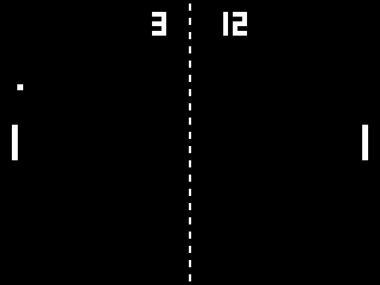

# pong-poliglota

O mesmo Pong implementado em 10 linguagens, todas sobre a **SDL2** (vídeo,
teclado e áudio). Assim a arquitetura é comparável entre elas: mesmas
constantes, mesmas funções (`update`, `bounce`, `render`, `draw_number`,
`square_wave`) e mesmo loop com física em passo fixo.



| Linguagem     | Pasta                | Binding SDL2                                  | Build                    | Executar                   |
|---------------|----------------------|-----------------------------------------------|--------------------------|----------------------------|
| C++17         | [`cpp/`](cpp/)       | headers C oficiais                            | CMake                    | `./build/pong`             |
| Rust          | [`rust/`](rust/)     | crate `sdl2` 0.38                             | Cargo                    | `cargo run --release`      |
| Go            | [`go/`](go/)         | `veandco/go-sdl2` (cgo)                       | `go.mod`                 | `./pong`                   |
| D             | [`dlang/`](dlang/)   | `bindbc-sdl` 1.5 (carga dinâmica)             | dub (`dub.json`)         | `./pong`                   |
| Object Pascal | [`pascal/`](pascal/) | unit própria `sdl2mini.pas` (`external`)      | FPC via `build.sh`       | `./build/pong`             |
| Perl          | [`perl/`](perl/)     | FFI::Platypus direto na `libSDL2`             | `cpanfile`               | `./pong.pl`                |
| Python        | [`python/`](python/) | PySDL2 (ctypes, API de baixo nível)           | `requirements.txt`       | `./pong.py`                |
| Lua (LuaJIT)  | [`lua/`](lua/)       | FFI do LuaJIT direto na `libSDL2`             | nenhum (só `luajit`)     | `./pong.lua`               |
| Java 25       | [`java/`](java/)     | API FFM (`java.lang.foreign`)                 | Maven (`pom.xml`)        | `java -jar target/pong.jar`|
| C# (.NET 10)  | [`csharp/`](csharp/) | P/Invoke com `[LibraryImport]`                | `dotnet` (`.csproj`)     | `dotnet run -c Release`    |

Cada pasta tem um `README.md` com as dependências e os comandos exatos de
build e execução.

## Especificação comum

- Janela 640×480, fundo preto, tudo branco (visual Atari/arcade)
- Raquetes 10×60: **W/S** controlam a esquerda, **↑/↓** a direita, a
  400 px/s. **Esc** sai.
- Bola 10×10 a 300 px/s. A cada rebatida em raquete a velocidade é
  multiplicada por 1,07 (teto de 720 px/s), e o ângulo de saída depende de
  onde a bola bateu na raquete (até 45°).
- Ponto quando a bola passa da raquete. A bola volta ao centro, espera 1 s e
  é sacada na direção de quem sofreu o ponto, com ângulo aleatório de até 30°.
- Placar no topo em fonte 3×5 desenhada com retângulos, sem SDL_ttf nem
  arquivos de fonte. Rede tracejada no centro.
- Física em passo fixo de 1/120 s (acumulador), independente do FPS. A
  renderização usa vsync.
- Áudio sintetizado em código: ondas quadradas S16 mono a 44,1 kHz,
  enfileiradas com `SDL_QueueAudio`. Não há arquivos de áudio.

  | Evento       | Frequência | Duração |
  |--------------|-----------:|--------:|
  | raquete      | 460 Hz     | 50 ms   |
  | parede       | 230 Hz     | 50 ms   |
  | ponto        | 490 Hz     | 250 ms  |

## Dependências de sistema (Fedora)

Tudo está nos repositórios padrão do Fedora; não é preciso RPM Fusion nem
COPR.

```bash
sudo dnf install gcc-c++ cmake sdl2-compat-devel rust cargo golang ldc dub fpc perl perl-FFI-Platypus perl-FFI-CheckLib python3 python3-pysdl2 luajit java-25-openjdk-devel maven dotnet-sdk-10.0
```

No Fedora 42+ a SDL2 é fornecida pelo `sdl2-compat` (a API SDL2 implementada
sobre a SDL3); o `-devel` traz os headers, o `SDL2Config.cmake` e o symlink
`libSDL2.so`.
